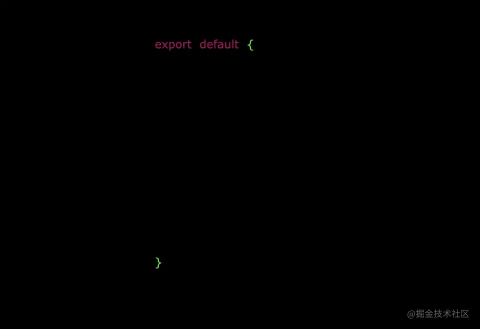
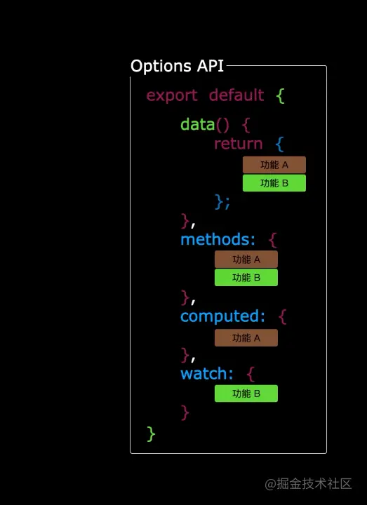
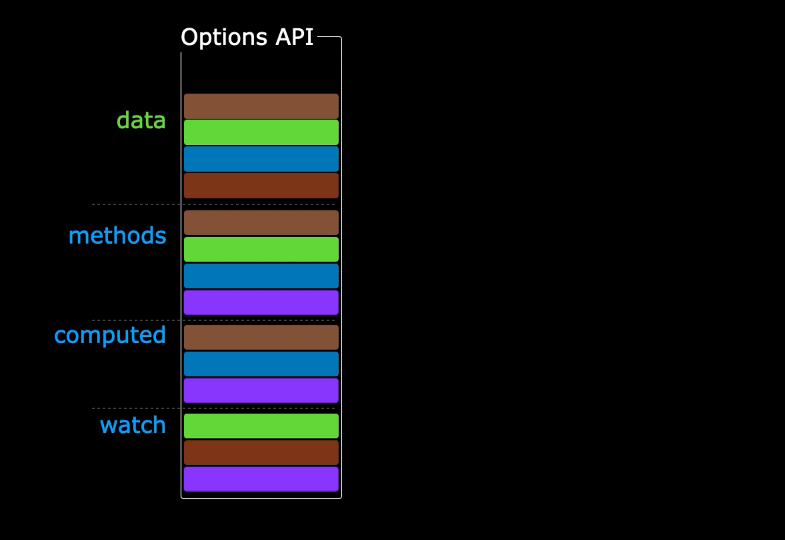
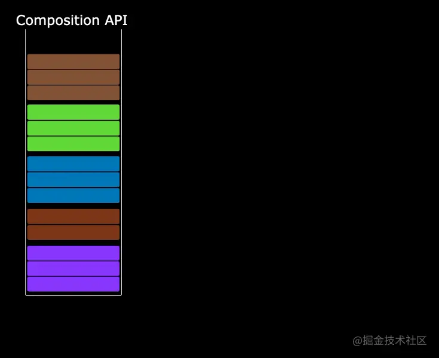

# 使用Composition API复用逻辑
## 写在前头
- 在一次看项目代码的时候，我发现了诡异的一幕，在一个SFC里有一个`outClick`的方法，我在当前界面查找时，结果什么也没找到，一个没有申明的函数，竟然被成功调用了，真是见鬼了。我再重新仔细阅读完当前单文件组件的代码时，才看到一个`mixins`混入了其他的方法，其中就混入了一个`outClick`方法，并成功调用。
- 这样的方法依赖太隐蔽了，第一次接触这样的代码(比如我)，就很难直接搞明白这其中的代码逻辑
## 接触Composition API
#### 下面的图很直观得展示了Vue2中的Option API和Vue3中的Composition API的区别
- Option API需要在指定的区域书写`data`,`computed`,`methods`,`watch`...等代码



- Option API在代码量不是很多的情况下，逻辑还是很清晰的，但是如果复杂度增加，同一个功能的逻辑就会被打碎，可读性就会下降，代码的复用性也不高



- Composition API要解决的就是把相同逻辑的代码放在一块，增加可读性，并提高代码的复用性




- 在GitHub上有一个[Composition API](https://github.com/vuejs/docs/blob/master/src/guide/composition-api-introduction.md)的使用介绍
## 复用逻辑
- ### 使用mixins混入的方式，的确可以解决代码复用的问题，就像下面这样
```js
// 组件里使用mixins混入方法
import mixins from './mixins'
export default {
  mixins: [mixins],  // 混入方法
  methods: {
    reduce() {
      this.count--
    },
  },
}
```
```js
// mixins.js
export default {
  data() {
    return {
        count: 1,
    }
  },
  methods: {
    add() {
      this.count++
    }
  },
}
```
:::warning
这样的确把add()有关的逻辑提了出来，并使用混入的方式进行代码复用，但是我们在SFC中如果代码量非常大，是很难察觉到add()这个方法是通过`mixins`混入的，如果不是这个界面的第一手开发人员，可读性并不友好
:::
- ### 现在使用Composition API来复用逻辑
```js
// 组件内代码
import useMixins from './mixins'
export default {
  setup() {
    const { count, add } = useMixins()
    return {    //return出去就可以用this.来调用
      count,
      add,
    }
  },
  methods: {
    reduce() {
      this.count--
    },
  },
}
```
```js
// mixins.js
import { ref } from '@vue/composition-api'
export default function useMixins() {
  const count = ref(1)   // 通过ref把这个count变成响应式的
  function add() {
    count.value++        //一定是.value  试过this.count也可以
  }
  return {
    count,
    add
  }
}
```
:::tip
这样和上面`mixins`实现的最终效果是一样的，而且在SFC中可以很清楚得看到add()方法的来源，有了这个来源也就不会存在变量冲突的情况，因为如果有同名的变量会报错，这样就不会对方法的来源依赖产生疑惑，完美得解决了mixins的缺点
:::
- ### 还有些小问题
- Composition API提供了很多生命周期函数，有时候在复用逻辑的时候，需要在生命周期函数里访问一些方法，数据，或者路由信息等，可以通过一个`getCurrentInstance()`方法去获取当前实例对象，并在属性`proxy`中就代理了该对象的内容，包括data，methods，$router，$store等内容
```js
onMounted(() => {
  let instance = getCurrentInstance()
  console.log('[ instance ]', instance.proxy.$store)
})
```
## 写在一块
Composition API替代mixins优势明显，可以把同一个逻辑打包成块并分割出去，这样抽离逻辑的能力是它的强大之处，这样就可以减少单文件组件里的代码量，可读性大大提高，复用逻辑之后还可以清晰依赖来源，对初次看这个SFC代码的人来说很友好，正如[官网](https://blog.vuejs.org/posts/vue-3.2.html)所说，更加符合人体工程学。:100: