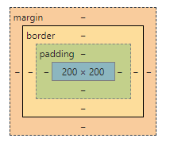
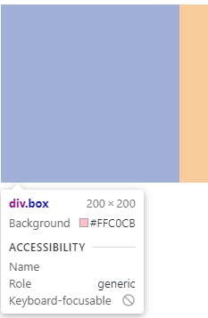
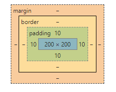
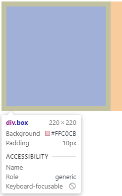
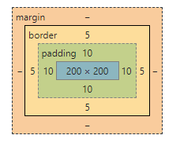
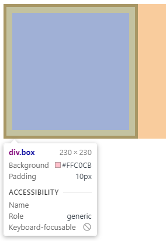
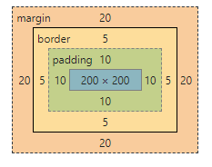
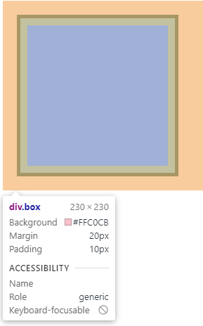
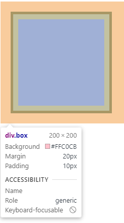

# CSS盒模型

#### W3C标准盒子模型

属性`width`,`height`只包含内容`content`，不包含`border`和`padding`

#### IE盒模型

属性`width`,`height`包含`content + padding + border`

- css新增属性`box-sizing`可以设置从而控制盒模型类型

`box-sizing: content-box`(默认值)，代表使用W3C标准盒子模型

`box-sizing: border-box`，代表使用IE盒模型

`box-sizing: inherit`，代表继承父元素的该属性

## 代码测试

```vue
<div class="box"></div>
.box {
  width: 200px;
  height: 200px;
  background-color: pink;
}
```



此时盒子大小



设置`padding: 10px`



此时盒子模型的大小已经发生了改变




设置`border: 5px`



盒子大小发生变化



设置`margin: 20px`



这次盒子大小没有发生变化



设置`box-sizing: border-box`，盒子大小只是200px * 200px



## 总结

W3C标准盒模型：`width` 和 `height`只是`content`的尺寸

IE盒模型：`width = content + padding + border`      `height = content + padding + border`

