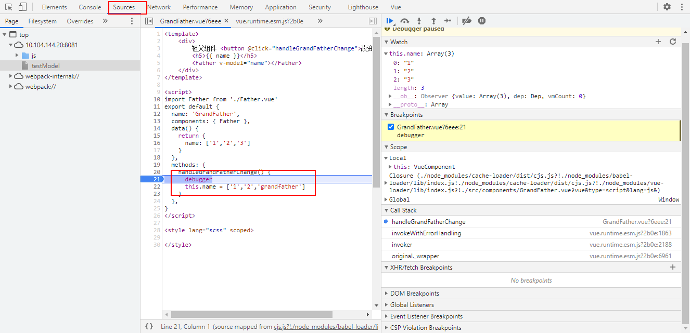
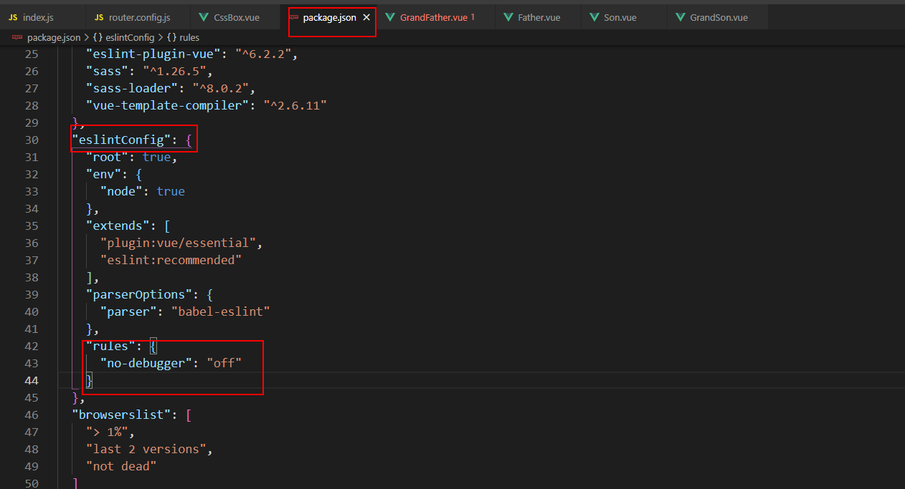
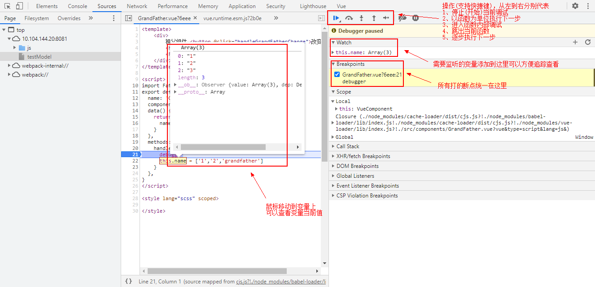

# chrome浏览器打断点调试
- 之前前端做调试，始终是局限在`console.log()`，这次我决定做点改变，使用一下谷歌浏览器断点调试，打打断点，瞅瞅变量
## 准备
在js语句中添加`debugger`，浏览器运行的时候会自动跳转到调试工具里的`Sources`工具栏里
```js
methods: {
    handleGrandFatherChange() {
      debugger
      this.name = ['1','2','grandfather']
    }
  },
```
效果如图 :point_down:



:::warning
如果出现报错，需要在`package.json`文件下的`eslintConfig`字段下的`rule`字段添加一条`"no-debugger": "off"`


:::
## 开始
调试界面主要操作

## 总结
##### chrome浏览器打断点调试主要步骤
- 1、在合适的js语句中使用debugger语句，创建断点，运行进入调试界面
- 2、通过调试界面的一系列操作，捕获到问题并做修改 :100: