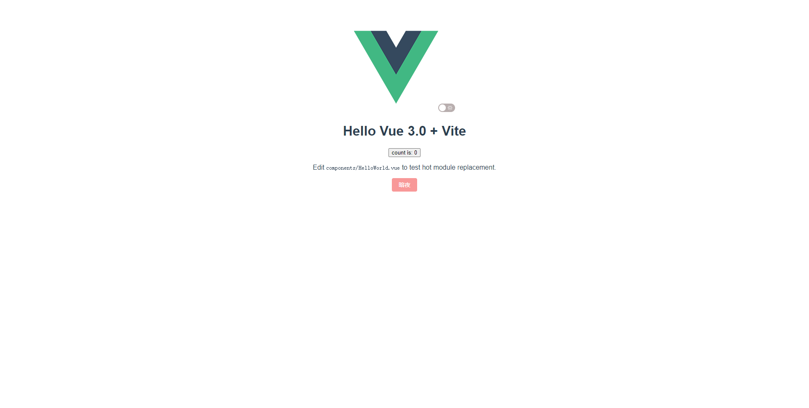

# 使用一个switch开关来实现暗夜主题和明亮主题的切换

#### 使用命令行初始化一个`vite+vue3`的项目
```sh
npm init vite switchTheme
```
## 基本思路
通过`switch`开关，来决定是否通过`link`标签来引入暗夜主题样式，从而来实现暗夜和明亮的切换

## 创建./public/css/dark.css

```css
:root {
    --text: #b8aeae;
    --background: #1d1d23;
}

body {
    background-color: var(--background) !important;
}

h1,
h2,
h3,
h4,
h5,
h6,
p,
span,
a {
    color: var(--text) !important;
}
```

### 在项目中引入`element-plus`
```sh
npm install element-plus --save
```

### 修改入口文件`main.js`

```js
import { createApp } from 'vue'
import App from './App.vue'
import './index.css'
import ElementPlus from 'element-plus'
import 'element-plus/dist/index.css'

createApp(App).use(ElementPlus).mount('#app')

```

### 修改`App.vue`
```vue
<template>
  
  <el-switch
    v-model="dark"
    inline-prompt
    :active-icon="Moon"
    :inactive-icon="Sunny"
    style="--el-switch-on-color: #1d1d23; --el-switch-off-color: #b8aeae"
    @change="handleChangeTheme"
  />
  <HelloWorld msg="Hello Vue 3.0 + Vite" />
</template>

<script>
import { Sunny, Moon } from "@element-plus/icons-vue";
import HelloWorld from "./components/HelloWorld.vue";

export default {
  name: "App",
  components: {
    HelloWorld
  },
  data() {
    return {
      Sunny,
      Moon,
      dark: false
    };
  },
  methods: {
    // 根据switch开关来判断是否引入dark.css
    handleChangeTheme() {
      const linkDom = document.getElementById("theme-switch");
      if (this.dark) {
        linkDom.setAttribute("href", "./css/dark.css");
      } else {
        linkDom.setAttribute("href", "");
      }
    }
  }
};
</script>

```
## 效果
- 明亮模式



- 暗黑模式

