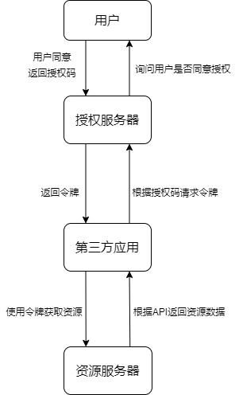
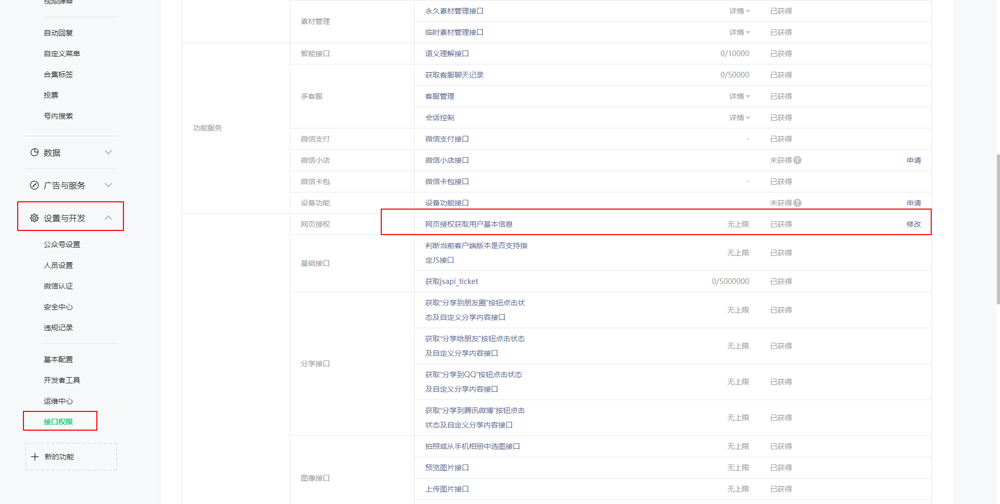

# 微信公众号网页授权
用于获取用户信息，实现授权登录，如何获取到微信公众号网页授权呢？
## 问题解决

##### 查阅[微信开发者文档](https://developers.weixin.qq.com/doc/offiaccount/OA_Web_Apps/Wechat_webpage_authorization.html)

> 如果用户在微信客户端中访问第三方网页，公众号可以通过微信网页授权机制，来获取用户基本信息，进而实现业务逻辑，微信网页授权是通过`OAuth2.0`机制实现的

#####  OAuth2.0授权机制

`OAuth2.0`指的是一种授权机制，第三方应用，即客户端向资源所有者请求授权的同意，资源所有者同意后，客户端即可向授权服务器请求授权码，资源服务器可以根据授权码向客户端颁发令牌，客户端通过令牌去向资源服务器请求需要的数据，整个流程大致如下


##### 总结下来大概是以下步骤

- 步骤一：前往微信开放平台-第三方平台-详情-开发配置-完成权限集和开发资料的配置
- 步骤二：调用接口获取预授权码`code`
- 步骤三：准备授权回调URL(回调URL必须在微信公众号配置的域名下的路径)
- 步骤四：授权确认后会自动跳转至回调URL，后面自动拼接返回授权码
- 步骤五：调用接口生成`access_token`，然后以该`token`调用公众号相关`API`

##### 开始逐步执行
- 在步骤一，需要在微信公众号的域名配置中设置对应的域名，该域名即为可在外网环境访问的域名，在步骤三中的回调地址的路径，必须要在该域名下才能成功，配置好之后的域名需要提供给开发者，以便进行预授权码的接口调用及获取，需要按照以下步骤按照提示配置


- 步骤二到步骤四，每个微信公众号在微信公众平台有一个唯一的标识，即`appId`，第一次可以通过接口向后端获取，保存于前端本地，用于获取`code`的请求参数，请求的微信服务器地址为`https://open.weixin.qq.com/connect/oauth2/authorize`，请求参数拼接在url之后，即可发起请求

  ```js
  const fetchAppId = async() => {
      // 如果是返回到该页面，则没有必要再次请求
      if(window.sessionStorage.getItem('appId')) {
          return window.sessionStorage.getItem('appId')
      }
      else {
          // 通过后端接口去获取appId，并缓存在浏览器中
          const { appId } = await api.fetchAppId()
          window.sessionStorage.setItem('appId', appId)
          return appId
      }
  }
  const appId = fetchAppId()
  ```

  ```js
  const getAuthCode = () => {
      const redirectUrl = window.location.origin + window.location.pathname
      const params = {
          appid: appId,
          redirect_uri: encodeURI(redirectUrl),
          response_type: 'code',
          scope: 'snsapi_base',  // 静默授权
          state: 'fromWechat',
          connect_redirect: "1",
      }
      // appid         ------ 公众号的唯一标识
      // redirect_uri  ------ 回调路径，不是redirect_url
      // response_type ------ 返回类型，为code
      // scope         ------ 静默或非静默授权
      // state         ------ 非必填
      // connect_redirect --- 避免链接回调页面两次
      // 如果向微信服务器请求成功会带上code拼接在后面，返回到redirectURL
      window.location.href = 	`https://open.weixin.qq.com/connect/oauth2/authorize?${qs.stringify(
          params
      )}`
  }
  ```
- 步骤五：回调页面的`url`路径后面会拼接上code值，前端自行截取即可使用，code值是获取`access_token`的票据，每次用户授权带上的code值都不一样，5分钟未使用自动过期，获取到`access_token`后即可根据需要，自行调用接口获取用户信息等操作

## 问题汇总

1、`redirect_uri`是微信公众号配置的域名下的路径

2、获取`code`时`redirect_uri`报错的可能原因，微信公众号的`appId`不正确，或者`redirect_uri`没有进行` urlEncode `处理，或者`redirect_uri`被` urlEncode `重复处理，qs默认是会进行一次` urlEncode `处理的

3、`scope`参数可分为`snsapi_base`静默授权，是获取用户`openid`的，用户无感知的授权，不需要用户确认，`snsapi_userinfo`非静默授权，是获取用户基本信息的，用户需要手动确认是否进行授权

4、调用成功的前提是用户需要关注公众号

5、要使用预授权码`code`的原因是，该过程需要重定向，`access_token`令牌暴露则会有失窃风险，所以需要`code`来在中间进行过渡

## 总结

微信公众号授权开发流程

1、微信公众号配置外网可访问的域名，关注该公众号

2、通过微信公众号唯一标识`appId`向微信服务器获取`code`并拼接在回调路径的末尾

3、利用`code`作为票据向微信服务器获取`access_token`，通过`access_token`调用接口获取用户信息等操作