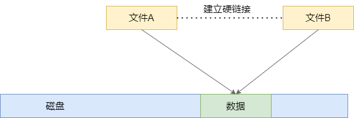
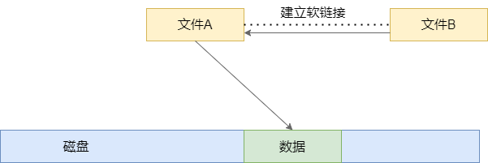
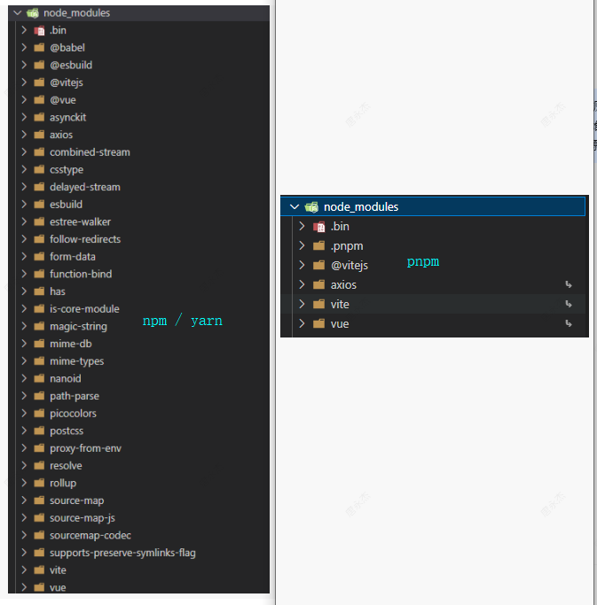
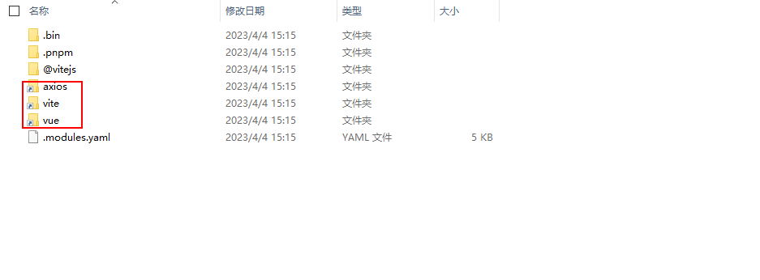
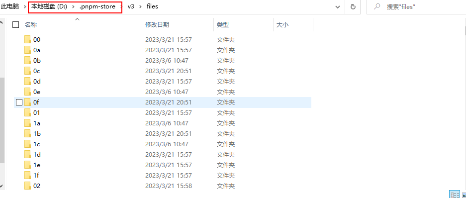
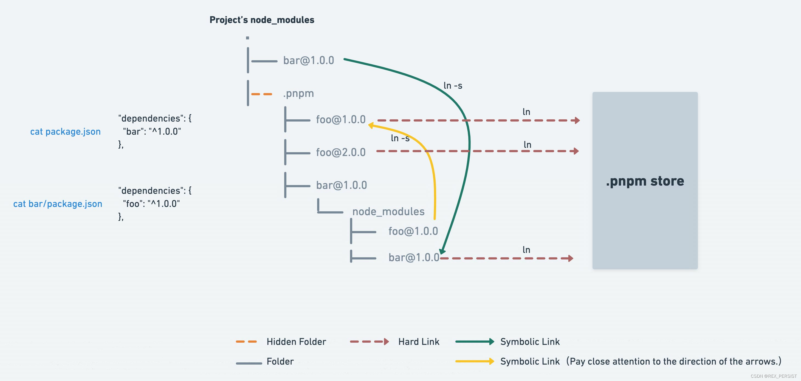

# pnpm依赖包管理


### pnpm简介

[`pnpm`](https://github.com/pnpm/pnpm)指的是`performant npm`(高性能的npm)，作为一个`javascript`的包管理安装工具，它能节约磁盘空间，并快速安装

### 使用

1、安装

```shell
npm install pnpm
```

2、初始化

```shell
pnpm init
```

3、下载依赖

```shell
pnpm install
```

### 优化磁盘空间的原理

pnpm使用软硬链接来管理`node_modules`目录，从而实现了不同项目中的依赖包的复用性，从而减少每次安装依赖包的时间和减少磁盘空间

- 硬链接，如下图，当文件A和文件B都指向磁盘中的某一段数据的存储空间地址，则此时两个文件之间则建立硬链接关系



- 软链接，如下图，当文件A指向磁盘中的某一段数据的存储空间地址，文件B又指向文件A，此时两个文件之间则建立软链接关系



### 对比npm，yarn依赖包管理工具

这里使用`vite`创建`vue3`项目，然后分别使用`npm`，`yarn`，`pnpm`来安装必要的依赖项，看看实际`node_module`中的依赖包是如何管理和存储的

使用pnpm install时会提示如下信息，表明当前的依赖已经硬链接到虚拟存储空间


npm和yarn的`node_module`文件结构都是把所有相关依赖都平铺列出来，而pnpm只是把`package.json`中的直接依赖平铺出来，然后有个`.pnpm`文件，pnpm的依赖的结构相对来说更加清晰



npm 和 yarn的依赖包完全地平铺在了`node_modules`文件中存在的问题

1、幽灵依赖：package.json中的直接依赖的依赖(没有直接注册的包)可以被开发者引用(非法访问)，若注册的包不依赖引入的包了，那么此时引入的地方会报错，且不好排查

2、扁平平铺的算法复杂度比较高，在依赖安装过程中会比较耗时，若项目依赖较多，则`node_modules`中文件夹会非常多，不方便查看

在pnpm安装的依赖包中，`package.json`注册的依赖包会平铺出来，更加直观，而其他的依赖的依赖都在.pnpm中统一管理，这样就可以解决幽灵依赖的问题了，开发者能引用的只能是`package.json`中注册的依赖包，同时很多依赖包并不是实际的依赖包，而是指向实际依赖的软连接，相当于是快捷方式



不同项目的依赖又都硬链接到磁盘上的`.pnpm-store`文件上，从而复用项目之间的相同依赖



pnpm官方对软硬链接的图示

  

### pnpm安装依赖时的步骤

1、通过`package.json`查询注册的依赖项，并分析出直接依赖和间接依赖

2、`.pnpm store`中查看是否有相关依赖的缓存，有则直接使用，没有则下载到缓存中

3、工程根目录下的`node_modules`硬链接到`.pnpm store`，注册的依赖使用软链接到对应版本依赖文件

### 总结

`pnpm`依赖包管理工具使用软硬链接的方式，对直接注册的依赖平铺显示，其他子依赖包都在.pnpm文件中管理，这样可以减少重复依赖包的安装，减少磁盘占用空间，并在安装依赖包时使用了缓存，可以减少安装依赖包的时间，从而做到提升性能